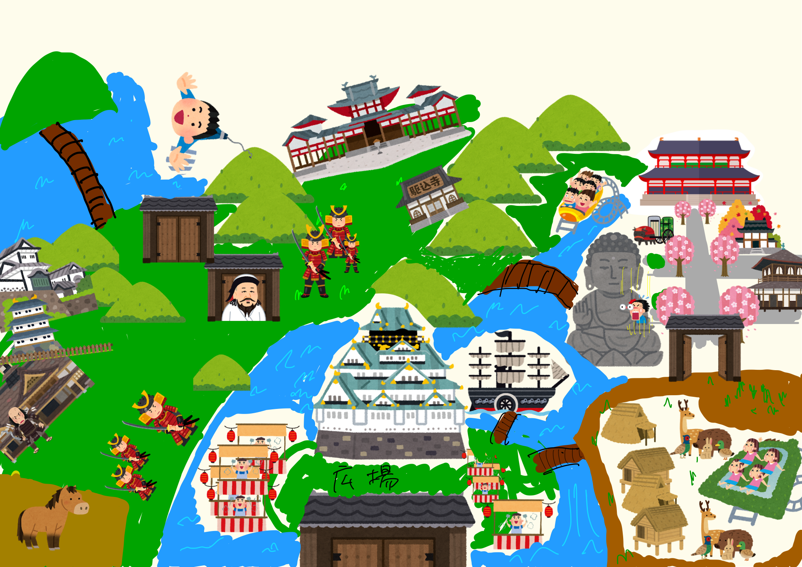

## <a href="#index">【公式】レキシーランド</a>
* [TOP](#anchor10)
* [エリア紹介](#eria)
* [イベント情報](#event)
* [代表挨拶](#repre)

## <a href="#anchor10">TOP</a>  

<!--この下に第1章の内容を書きます。-->
### レキシーランドにようこそ！

歴史に因んだ、アトラクション、イベントで楽しみながら歴史について学べる
そんな、社会貢献もしている、ありがたく素晴らしいテーマパーク！

バイトも募集中！時給520円、正社員昇格あり。
<!--この上に第1章の内容を書きます。-->

## <a href="#eria">エリア紹介</a>
<!--この下に第2章の内容を書きます。-->
### これが日本の歴史
・[飛鳥奈良エリア](https://takajo-soft16.github.io/NaraAsuka_Rekishi-land/index)

・[平安エリア](https://takajo-soft11.github.io/Heian-Period/)

・[安土桃山エリア](https://takajo-soft26.github.io/sengoku)

<!--この上に第2章の内容を書きます。-->

## <a href="#event">イベント情報</a>
* [レキシィクリスマス](#anchor1)
(2018年11月8日〜12月25日)
* [ニューイヤーイブ](#anchor2)
(2018年12月31日〜2019年1月1日)

## <a href="#anchor1">レキシィクリスマス</a>  
<!--この下に第1章の内容を書きます。-->
### レキシィランドならではの
### ファンタジックで”Happiest”なクリスマス！
５才以下のお友達には、織田信長、豊臣秀吉、徳川家康がプレゼントを配ってくれるよ。
<!--この上に第1章の内容を書きます。-->

## <a href="#anchor2">ニューイヤーイブ</a>
<!--この下に第2章の内容を書きます。-->
### 新たな年の幕開けを
### 一緒にお祝いしましょう！
奈良飛鳥平安エリアで源氏と平氏に分かれて歌合戦が行われるよ。
戦国エリアでは年が変わる瞬間に狼煙が上がって、織田信長軍が火縄銃をぶっ放すよ。
江戸エリアでは江戸城がすごい事になるよ。
<!--この上に第2章の内容を書きます。-->

## <a href="#repre">代表者挨拶</a>

こんにちわ
